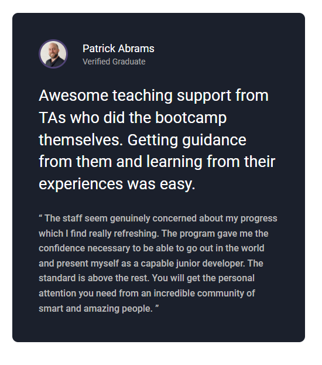
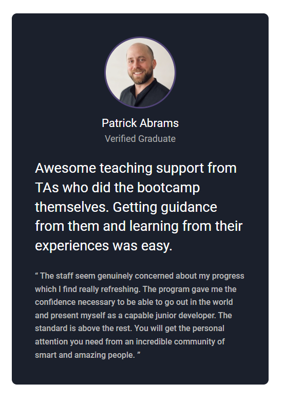

# Frontend Task for IEEE Community

This repository contains the solution to <b>a beginner-level</b> frontend task using HTML and CSS.

> check it here: Live Demo: 

## Project Overview

The task involved designing and implementing a **testimonial card** featuring:
- A profile picture of the individual
- Their name and role
- Testimonial content with responsive styling

This project demonstrates my skills in:
- HTML structure
- CSS styling
- Basic responsive design techniques

## Features

- **Responsive Design**: Adapts to different screen sizes using media queries.
- **Clean Layout**: Professional card design with modern CSS.

## Screenshots

